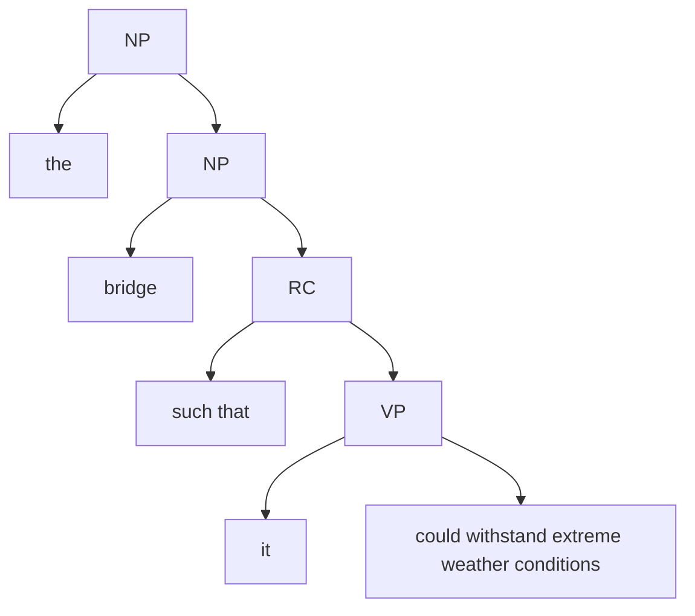

# Pronouns and abstraction 

We have established a specific rule for interpreting pronouns, such as 'he', 'she', 'she', 'her', and so on. Generally, their interpretation depends on context. 

However, this does not mean that they are always used in this manner. Consider the following examples.  

1. They built the bridge such that **it** could withstand extreme weather conditions.
2. He is a leader such that the people follows **his** advice without question.
3. John is a person such that anyone who meets **him** remembers **him** forever.

First of all, the extensional meanings of these pronouns co-vary with **their antecedents within the sentences**, being indepedent to context. 

Consider the assignment function

```
g = {1 : F('the World Trade Center'), 2 : F('the Empire building')
```
What if the pronoun is indexed with 1? 

(a) They built the bridge such that **it**_1 could withstand extreme weather conditions. <br>

This sentence would be interpreted as follows: They built the bridge such that the World Trade Center could withstand extreme weather conditions' <br>

However, this is not a possible reading for Sentence 1. 

There is another issue raised by this sentence.  



```
Discussion:  

(a) What is the extensional meaning of 'bridge', and what is its semantic type?
(b) What is the appropriate semantic type for the 'such that' clause?

```
--- 
### Abstraction

To capture binding, we posit a new computation rule---Abstraction. 

**Abstraction**: For any linguistic expression $X$ and any index $n$, $n\ X^{M,g} = \lambda x.n\ X^{M,g[n \rightarrow x]}$

**Assignment updating**: For any assignment function $g$, $g[n \rightarrow x]$ is a **new** assignment that mirrors $g$ except mapping $n$ to $x$.  

```
Discussion: Consider g = [1 --> the World Trade Center, 2 --> the Empire building, ...]

g[1 --> x] = 

```

We propose that 'such that' triggers abstraction during semantic computation. 

$\text{such that}\ \text{it}_1\ \text{could withstand extreme weather conditions}^{M,g} = 1\ [\text{it}_1\ \text{could withstand extreme weather conditions}]^{M,g}$ <br>
$= \lambda x. \text{it}_1\ \text{could withstand extreme weather conditions}^{M,g[1 \rightarrow x]}$ <br>
$= \lambda x. \text{withstand-weather}'(g[1 \rightarrow x] (1))$ <br>
$= \lambda x. \text{withstand-weather}'(x)$

Can you see how this result addresses the two problems introduced at the beginning of this session?

```
Exercise: Compute the meaning of the following expression

(a) the leader such that the people follows his_1 advice without question

```
